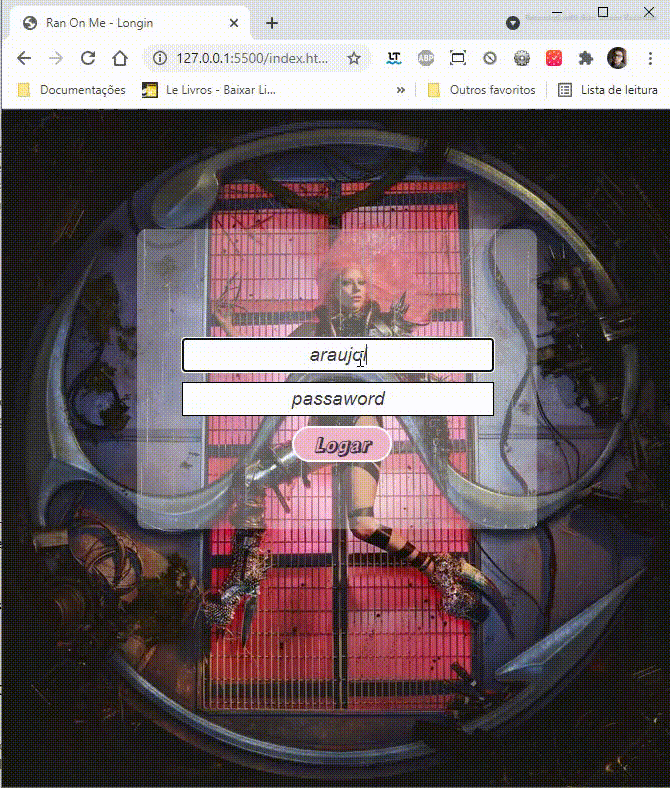
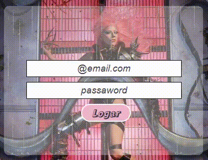

# Projeto: Algoritmos e Lógica de Programação 👨‍💻💻

    <a href="#sobre" align=center>Sobre</a>&nbsp;&nbsp;&nbsp;
    <a href="#especificos" align=center>Específicos</a>&nbsp;&nbsp;&nbsp;
    <a href="#status" align=center>Status</a>&nbsp;&nbsp;&nbsp;
    <a href="#recursos" align=center>Recursos & Linguagens</a>&nbsp;&nbsp;&nbsp;
    <a href="#observacoes" align=center>Observacoes</a>&nbsp;&nbsp;&nbsp; 
    <a href="#autor" align=center>Autor</a> 

<h2 id="sobre">Sobre</h2> 

Este é meu primeiro projeto de Longin, onde decidi criar baseado no albúm Chromática de Lady Gaga, tendo algumas estilizações e efeitos do clipe Rain On Me

 

  

<h2 id="especificos">Específicos</h2> 

* Noção de fluxo de elementos; 
* Foram aplicados conceitos de posicionamento de elementos;
* Foram aplicados estilizações de fontes nos inputs;
* Foram escolhidas cores baseadas na imagen background do albúm Chromática;

<h2 id="status">Status</h2> 

***Concluído*** 🚀💻

 

<h2 id="recursos">Recursos & Linguagens</h2> 

* Html 
* CSS
* Seletor de cores IMAGE COLOR PICKER
* Git 
* GitHub
* IDE (Visual Studio Code 
 

<h2 id="observacoes">Observações</h2> 

* Efeito Chuvinha no formulário

  

<h2 id="autor">Autor</h2> 

 Meu nome é Leonardo, mas gosto de ser o Leo. Estou me graduando em Sistemas de Informação e meu foco é crescer na carreira de Web Developer (Desenvolvedor Web).
 

 Tomei essa decisão, após sair de uma conhecida e ascendente empresa TELECOM (Provedora de Internet) da minha cidade. Durante jornada com o time e ajudando nas atividades do setor, ao qual fui responsável, percebi a influência da internet, aplicações, sites e sistemas de gerenciamento de empresas (ERP's) nas relações e interatividades entre pessoas e organizações. Além disso, a empresa me proporcionou treinamentos sobre o quanto a tecnologia ajuda e facilita nas rotinas de seus clientes e usuários. Decidi pela área de desenvolvimento, porque tenho oportunidade de usar minhas habilidades criativas, analíticas, comunicações empáticas e racionais, como também à minha disposição colaborativa quando lido com processos.
 

<h3 align=center><i>Gostos e Hobbies </i>📖🙋‍♂️</h3>  

Caminhar, correr, ciclismo, exercícios físicos, estudar, ler, desenvolver projetos, aprender desenvolvendo de sites e aplicações, fazer novas conexões (networking).
 

    <h3><strong>Contatos</strong></h3>
     
    
    &nbsp;&nbsp;&nbsp;&nbsp;&nbsp;&nbsp;&nbsp;&nbsp;&nbsp;
     
    &nbsp;&nbsp;&nbsp;&nbsp;&nbsp;&nbsp;&nbsp;&nbsp;&nbsp;
       
    &nbsp;&nbsp;&nbsp;&nbsp;&nbsp;&nbsp;&nbsp;&nbsp;&nbsp;
    

